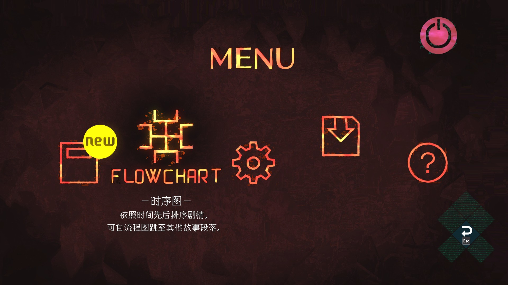
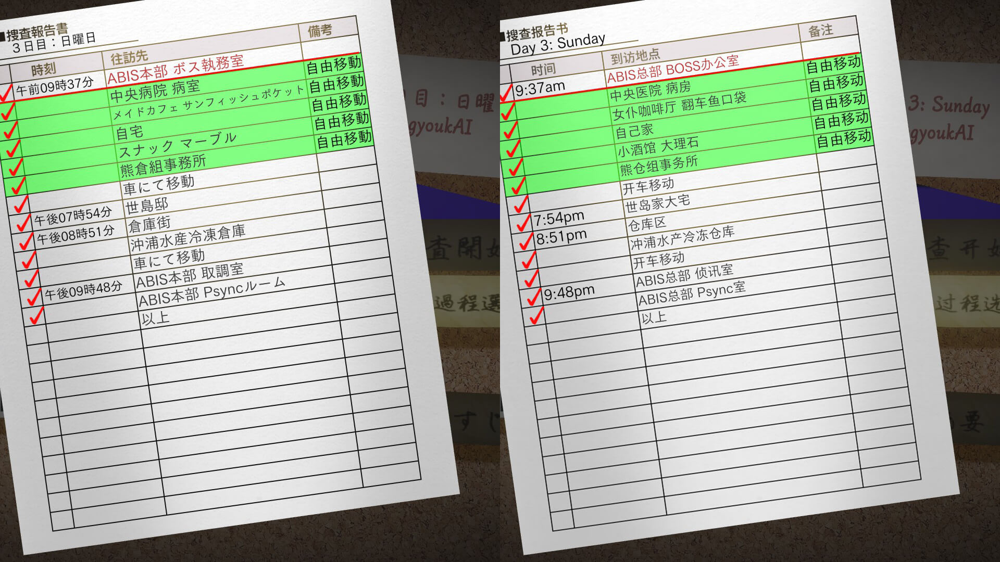

# 《AI：梦境档案》简中补丁字体优化

## 基本说明

原项目链接：[Xzonn/AITSFChsPatch: 《AI：梦境档案》简体中文补丁](https://github.com/Xzonn/AITSFChsPatch)

使用方式不再赘述。

优化内容：

- 根据日文字型字重匹配字体
- 同上，修改部分贴图
- TextMeshPro对TrueType和OpenType特性支持非常有限，排版效果并不好（例如无法实现标点挤压），停用直角引号简化

## 字体匹配

| 应用场景                            | 官日                  | 官繁           | 简体匹配         | 备注                         |
| ----------------------------------- | --------------------- | -------------- | ---------------- | ---------------------------- |
| MENU                                | FOT-NewCinemaBStd-D   | 華康龍門鐵線W3 | 不匹配，保留繁体     | 知名无匹配字幕专用字体，用NewCinemaA暂代     |
| 对话1、搜查概要、互动选项、确认弹窗 | FOT-SkipStd-M         | 華康圓體W3     | 汉仪润圆55W      |                              |
| 时序图章节标题                      | FOT-SkipStd-B         | 華康圓體W5     | 汉仪润圆75W      |                              |
| 对话2                               | FOT-KleePro-DB        | 華康仿宋體     | 霞鹭文楷R        | 同源                         |
| 文件                                | FOT-KleePro-DB        | 華康秀風體     | 霞鹭文楷R        | 同源                         |
| 章节标题                            | FOT-KleePro-M         | FOT-KleePro-M  | 霞鹭文楷L        | 同源                         |
| 梦界目标、地名                      | FOT-KafuTechnoStd-E   | 華康新綜藝體W7 | 方正新综艺黑DB   |                              |
| ？                                  | FOT-KafuTechnoStd-H   | 華康新綜藝體W7 | 方正新综艺黑SB   |  没找到用在哪里                 |
| TE结局舞蹈字幕                      | FOT-NewCinemaBStd-D   | 華康新綜藝體W7 | 不匹配，保留繁体     |                              |
| 信息框名字、梦界UI                  | FOT-AraletStd-DB      | 華康粗黑體     | 方正醒黑DB       |                              |
| 教程、操作UI                        | FOT-TsukuGoPro-M      | 華康中黑體     | 方正FW筑紫黑M    | 同源                         |
| 搜查报告书（进度）                  | FOT-TsukuGoPro-M      | 華康圓體W3     | 方正FW筑紫黑M    | 怀疑本地化挂错字体           |
| 梦界互动选项      | FOT-TsukuBOldMinPr6-R | 華康周氏行楷   | 华康周氏行楷     | 假名印象比重更大             |
| “事件还没有结束”      | FOT-TsukuBOldMinPr6-R | 華康仿宋體   | 华康周氏行楷     | 假名印象比重更大             |
| 结局标题                            | FOT-TsukuBOldMinPr6-R | 華康儷宋       | 方正FW筑紫明朝宋 | 基本同源                     |
| 时序图便签（标题）、条目新增便签    | FOT-KafuMarkerStd-B   | 華康秀風體     | 文鼎P大签字笔    |                              |
| 时序图便签、文件新增便签            | FOT-KafuPenjiStd-L    | 華康秀風體     | 文鼎细钢笔行楷   | 贴图，游戏内没有直接使用     |

## 截图预览

  
  

## 原文效果对比

## 已知Bug

